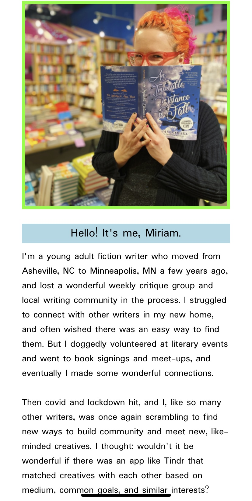

# The Write Match!

## Table of Contents

- [Description](#description)
- [Screenshots](#screenshots)
- [Built With](#built-with)
- [Getting Started](#getting-started)
  - [Prerequisites](#prerequisites)
  - [Installation](#installation)
- [Usage](#usage)
- [Acknowledgements](#acknowledgements)
- [Contacts](#contacts)

## Description

'The Write Match' is a matching app that aims to help connect writers based on what they are looking for and what they have to offer each other. Users log in with a unique username and password, and then create a profile that includes their genres, what they are looking for, and what they have to offer. They are then matched with other writers. They can select matches, and if confirmed by the other user, they have the option to contact their match. They can also delete selected matches if they change their mind.

## Screenshots

## Built With

## Getting Started

This application will fully support Chrome browser on iOS mobile. All other browsers are considered out of scope.

### Prerequisites

Express - a web framework for Node.js;
Postgresql - an open source relational database

### Installation

There is a database.sql file to use to set up a database. After that once you fork and clone the repository, you should be able to run npm install, then run the server and client to be able to use the app.

## Usage

When the user lands on the homepage, they will be able to log into the app if they have already created a username and password, which will direct them to their profile page. If they have never logged in before, they can click on "Register," which will route them to the registration page.

Once they have created their username and password, they will be directed to the Create Profile page, where they will enter information into several inputs before submitting. Once they have submitted, they will be routed to the View Profile page. From there, the user can go to either the New Matches or Current Matches pages.

On New Matches, they will be presented with other writers whose profiles have been matched with theirs based on their profile. They can select writers to match with on this page. On the Current Matches page, they can view their current matches. They will be displayed as either "Awaiting Confirmation," which means that the other user has not yet also selected the user as a match, or as "Confirmed Match!" which means that they other user has also selected them. If they have both selected each other, they will have the option to view their contact information.

Next steps include:
-- An Edit Profile option so that writers can edit their inputs to view different matches
-- A Direct Messaging feature within the app
-- Increasing the sophistication of the matching algorithm
-- Deploying the app to Heroku!

## Acknowledgements

I would like to express my undying gratitude to Prime Digital Academy, my wonderful instructor Dev Jana, his incredible teaching assistant Casie Siekman, and my absolutely fabulous Ionian cohort that was cheering me on and helping me troubleshoot every step of the way. It is mind-blowing to think of the progress I've made over the past few months, and I'm so excited to see where I go from here.

## Contacts

 
