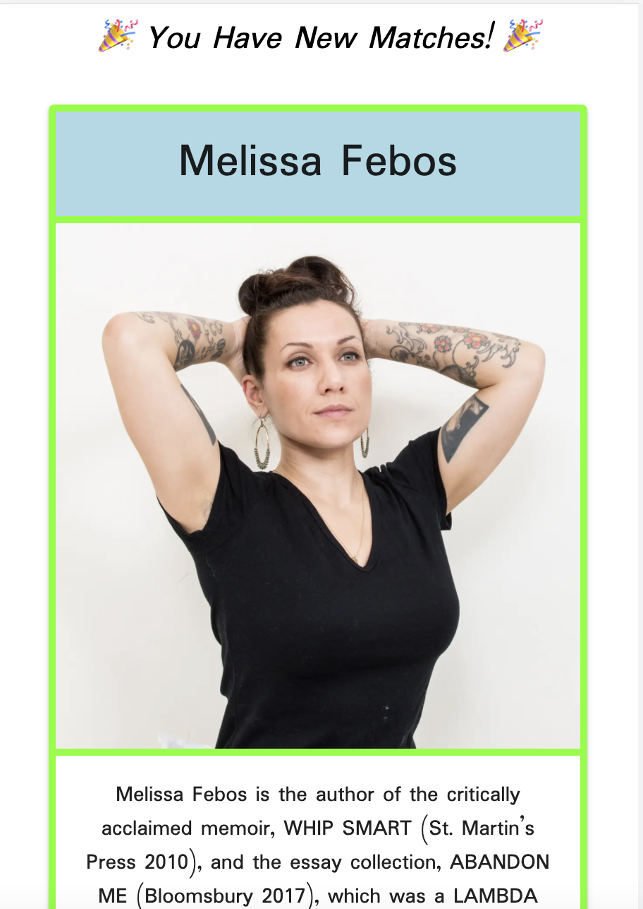
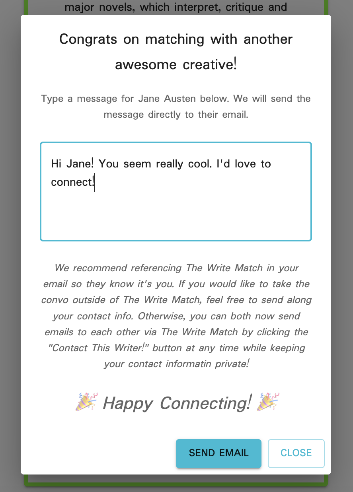

# The Write Match!

## Table of Contents

- [Description](#description)
- [Screenshots](#screenshots)
- [Built With](#built-with)
- [Getting Started](#getting-started)
  - [Prerequisites](#prerequisites)
  - [Installation](#installation)
- [Usage](#usage)
- [Acknowledgements](#acknowledgements)
- [Contacts](#contacts)

## Description

I'm a young adult fiction writer who moved from Asheville, NC to Minneapolis, MN a few years ago, and lost a wonderful weekly critique group and local writing community in the process. I struggled to connect with other writers in my new home, and often wished there was an easy way to find them. But I doggedly volunteered at literary events and went to book signings and meet-ups, and eventually I made some wonderful connections.

Then covid and lockdown hit, and I, like so many other writers, was once again scrambling to find new ways to build community and meet new, like-minded creatives. I thought: wouldn't it be wonderful if there was an app like Tindr that matched creatives with each other based on medium, common goals, and similar interests? That's when the idea for 'The Write Match' was born!

'The Write Match' aims to help connect writers based on what they are looking for and what they have to offer each other. Users log in with a unique username and password, and then create a profile that includes their genres, what they are looking for, and what they have to offer. They are then matched with other writers. The user can edit their profile as needed. They can select matches, and if confirmed by the other user, they have the option to contact their match via email through the app while keeping their contact information private. They can also delete selected matches if they change their mind.

## Screenshots

## Built With

## Getting Started

This application will fully support Chrome browser on iOS mobile. All other browsers are considered out of scope. Be sure to check out the prerequisites and database.sql files for install instructions and database requirements.

### Prerequisites

To properly host this application, NPM, nodemon, brew and Postico should be installed and available.

### Installation

A full list of requirements can be found in the dependencies section of the package.json file, including:

Express, Postgresql, MaterialUI, Nodemailer, GoogleAPIs, Passport, Axios

There is a database.sql file to use to set up a database. After that, once you fork and clone the repository to your local machine, you should be able to run npm install, then run the server and client to be able to use the app locally.

## Usage

When the user lands on the homepage, they will be able to log into the app if they have already created a username and password, which will direct them to their profile page. If they have never logged in before, they can click on "Register," which will route them to the registration page.

Once they have created their username and password, they will be directed to the Create Profile page, where they will enter information into several inputs before submitting. Once they have submitted, they will be routed to the View Profile page. From there, the user can go to either the New Matches or Current Matches pages, or click "Edit Profile" to return to the profile inputs and update as needed.

On New Matches, they will be presented with other writers whose profiles have been matched with theirs based on their profile. They can select writers to match with on this page. On the Current Matches page, they can view their current matches. They will be displayed as either "Awaiting Confirmation," which means that the other user has not yet also selected the user as a match, or as "Confirmed Match!" which means that they other user has also selected them. 

If both of the users have selected each other, they will have the option to contact the other writer. When the use clicks "Contact this Writer!" a modal will pop up. In this modal, the user can type a message to the other writer that will be sent to their email, while keeping their contact information secure. The writers will have the option to share additional contact information through The Write Match and take their conversation outside of the app, or they can continue to contact each other through the app as long as desired.

Next steps include:
-- A Direct Messaging feature within the app
-- Increasing the sophistication of the matching algorithm

## Acknowledgements

I would like to express my undying gratitude to Prime Digital Academy, my wonderful instructor Dev Jana, his incredible teaching assistant Casie Siekman, and my absolutely fabulous Ionian cohort that was cheering me on and helping me troubleshoot every step of the way. It is mind-blowing to think of the progress I've made over the past few months, and I'm so excited to see where I go from here.

## Contacts

 
